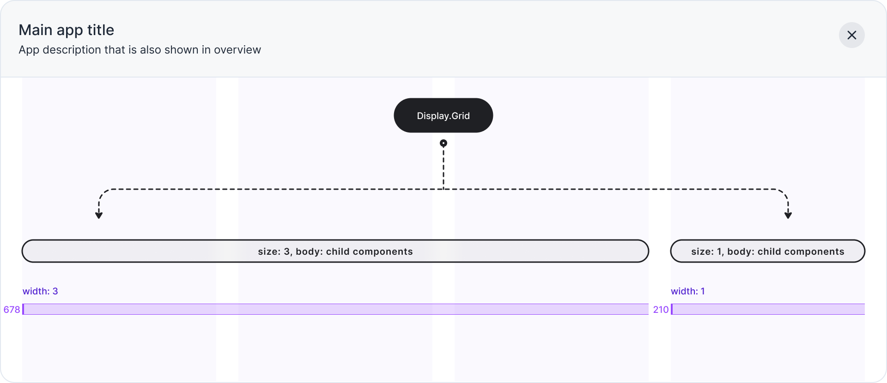

import { TabItem, Tabs } from '@astrojs/starlight/components'
import ComponentDemo from '@components/ComponentDemo.astro'
import FrameworkSelect from '@components/FrameworkSelect.astro'
import FrameworkContent from '@components/FrameworkContent.astro'
import PropDescription from '@components/PropDescription.astro'
import PropMarker from '@components/PropMarker.astro'
import { Image } from 'astro:assets'

import SpacingProps from '../../../components/SpacingProps.mdx'

<FrameworkSelect>
	<FrameworkContent>
		<Fragment slot="cdk">
			[Source](https://github.com/buttonize/buttonize/blob/master/cdk/components/display/grid.ts)
		</Fragment>
	</FrameworkContent>
</FrameworkSelect>

Displays the given components with the specified, grid-based layout.

```ansi frame="none"
Display.grid(columns, props)
```

<br />

### Creating layouts with Grid component

`Display.Grid` component can be used to create layouts with ease. It allows you to specify the size of each column (1-4).



## Usage

<FrameworkContent>
   <Fragment slot="cdk">
    ```ts title="lib/MyStack.ts" collapse={1-5}
    import { ButtonizeApp, Display } from '@buttonize/cdk'

    new ButtonizeApp(this, 'DemoApp', {
      name: 'Demo App'
    }).page('DemoPage', {
      body: [
        Display.grid([
          {size: 1, body: [Display.heading('Title')]},
          {size: 2, body: [Display.text('Some description to right instead of below')]}
        ])
      ]
    })
    ```

   </Fragment>
</FrameworkContent>

## Preview

<ComponentDemo
	components={[
		{
			typeName: 'display.grid',
			props: {
				columns: [
					{
						size: 1,
						body: [{ typeName: 'display.heading', props: { label: 'Title' } }]
					},
					{
						size: 2,
						body: [
							{
								typeName: 'display.text',
								props: { label: 'Some description to right instead of below' }
							}
						]
					}
				]
			}
		}
	]}
/>

## Props

<FrameworkContent>
	<Fragment slot="cdk">
    <PropDescription>
    		<Fragment slot="title">
    			{/* keep-good-prettier-formatting */}
    			### columns[].body
    		</Fragment>
    		<PropMarker slot="markers" type="required" />
    		<Fragment slot="type">IComponent[]</Fragment>
    		<Fragment slot="description">
    			Body of the grid column.
    		</Fragment>
    </PropDescription>
		<PropDescription>
			<Fragment slot="title">
				{/* keep-good-prettier-formatting */}
				### columns[].size
			</Fragment>
			<PropMarker slot="markers" type="optional" />
			<Fragment slot="type">1 | 2 | 3 | 4</Fragment>
			<Fragment slot="description">
				Width of the grid column.

        Total sum of all sizes must be less or equal `4`.

        Default is `1`.
    		</Fragment>
    </PropDescription>
    <SpacingProps />

  </Fragment>
</FrameworkContent>
