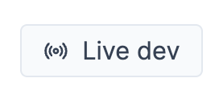
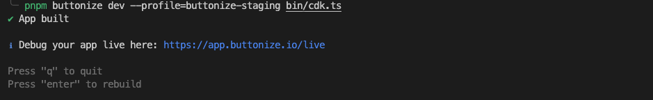

import FrameworkSelect from '@components/FrameworkSelect.astro'
import ScreenImage from '@components/ScreenImage.astro'
import { Tabs, TabItem } from '@astrojs/starlight/components'
import { LinkCard, CardGrid } from '@astrojs/starlight/components'

<FrameworkSelect />

Thanks to Buttonize's "live local development" feature, you can enjoy the comfort of hot reloading when developing Buttonize apps locally.

You can start live local development by pressing the "Live dev" button at the top right corner of any Buttonize screen.

<ScreenImage>
	<span class="flex justify-center">
		
	</span>
</ScreenImage>

## How to develop locally

:::caution
At the moment, Buttonize **doesn't handle the redeployment of your CDK code and lambda handlers**. So if you make any changes to your lambda functions or other resources,
they won't get deployed. For that we recommend using `cdk watch` in parallel with the Buttonize CLI.
:::

:::note
At this stage, the app is not deployed to AWS yet. So invoking any [Actions](/core-concepts/actions/) won't work.

You can deploy your app with `$ cdk deploy` and then click on the `Rebuild` button in Buttonize.

This will refetch all the necessary data to invoke your AWS resources even during local development.
:::

In order to develop Buttonize apps locally, you must first sign-up at [app.buttonize.io](https://app.buttonize.io).

Once you are signed in and [you have your Buttonize app](/getting-started/build-your-first-app/) in your CDK project, you can run:

<Tabs>
  <TabItem label="npm">

```bash
npx buttonize dev --profile=YOUR_AWS_PROFILE bin/your-cdk.ts
```

  </TabItem>
  <TabItem label="pnpm">

```bash
pnpm buttonize dev --profile=YOUR_AWS_PROFILE bin/your-cdk.ts
```

  </TabItem>
  <TabItem label="yarn">

```bash
yarn buttonize dev --profile=YOUR_AWS_PROFILE bin/your-cdk.ts
```

  </TabItem>
</Tabs>

Once you run the command, Buttonize starts processing the CDK code and after you see the green checkmark, it's ready to go.

After every save of your CDK code, Buttonize will rebuild the CDK projects and show you the updated view within seconds.

You can quit the CLI by clicking on the terminal and pressing the `q` or `esc` key.

<ScreenImage>
	
</ScreenImage>

<ScreenImage>
	
</ScreenImage>

### Controls

There are a couple of controls you can use during live local development.

- **Restart state**

  This button resets and empties the [Runtime State](/core-concepts/runtime-state/) of the application and returns you to the first page of the application.

- **Rebuild**

  This button is useful when, for example, you deploy your application with `cdk deploy` and you want Buttonize to refetch the metadata from AWS, such as the
  execution role ARN or the Lambda function ARNs.

- **State**

  This tab shows the current Runtime State of the application.

- **"Write JMESPath here to search in the state..."**

  You can use this input to debug your JMESPath expressions for [variables](/core-concepts/variables/).

- **Logs**

  Here, you can view which operations Buttonize performed in the background, such as fetching of IAM credentials or invoking [Actions](/core-concepts/actions/).

## How it works under the hood

- The CLI...
  1. creates a directory in your system's temp folder
  2. copies your project files to the temp folder
  3. watches for any changes in your project and copies the changes to the temp folder
  4. starts the TypeScript compiler in watch mode to compile the project to JS
  5. dynamically imports the CDK project file and searches for an exported variable which is of the type `cdk.App`
  6. searches the stacks to find Buttonize CDK resources
  7. extracts the Buttonize resources
  8. tries to fetch the stack metadata and resources from AWS, if the stack has been deployed
  9. puts everything together and waits for the local connection from [app.buttonize.io/live](https://app.buttonize.io/live)
- Buttonize Live Local Development UI...
  1. tries to connect to the local dev server
  2. pulls the data and watches for any changes
  3. renders the application

---

In case you encounter any issues, please let us know [on Discord](https://discord.gg/2quY4Vz5BM). We will do our best to make the live local development work with your CDK project.
