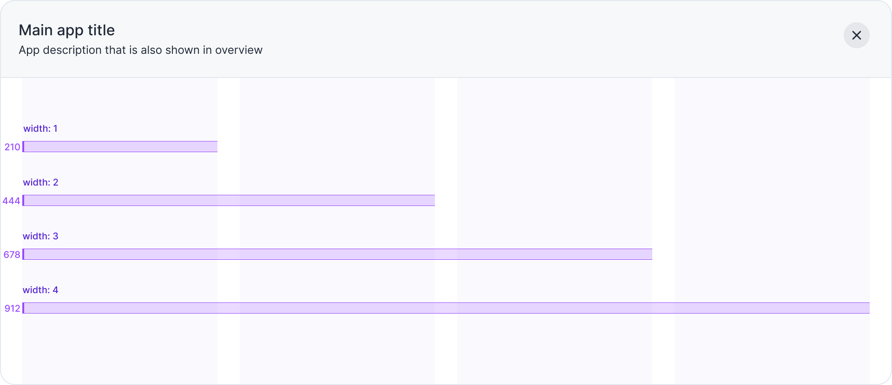
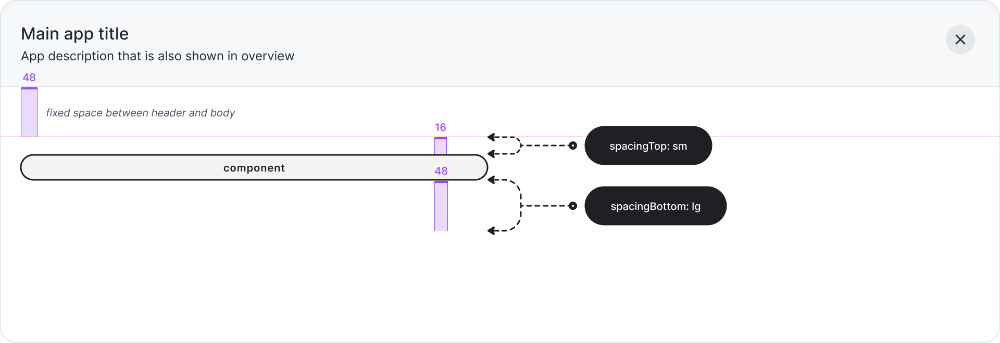

Buttonize design system have a highly opinionated approach to interface design. This system is engineered to increase productivity while ensuring reation of functionally sound UI out of the box.

## Grid System

Each application developed using Buttonize adheres to a fixed four-column grid layout providing a robust foundation for creating well-structured layouts.

## Vertical Spacing

Each component have default size that can be overriden via "width" prop. This prop is directly corresponding to the number of columns (1 -4) that the element should span within the application.

## Horizontal Spacing

Each component have default setting for horizontal spacing between components. Horizontal spacing can be overriden via: `spacingTop` and `spacingBottom` props.

