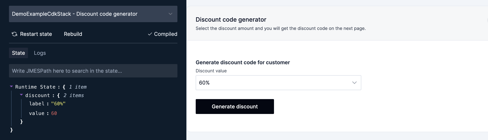

import ComponentDemo from '@components/ComponentDemo.astro'
import FrameworkSelect from '@components/FrameworkSelect.astro'
import FrameworkContent from '@components/FrameworkContent.astro'
import ScreenImage from '@components/ScreenImage.astro'

<FrameworkSelect />

As described in the previous section Buttonize has concept of [Runtime State](/core-concepts/runtime-state/).

You can access the runtime state value in your Buttonize app by using double curly brackets `{{expression}}` notation in your code.
The `expression` must be a valid [JMESPath](https://jmespath.org).

## Simple example

```text title="Expression" frame="terminal"
platform.value
```

<FrameworkContent>
  <Fragment slot="cdk">
    ```ts title="lib/MyStack.ts" collapse={1-8} "platform"
    import { Buttonize, ButtonizeApp, Display, Input } from '@buttonize/cdk'

    Buttonize.init(this, {
      apiKey: 'btnz_mybuttonizekey1234567'
    })

    new ButtonizeApp(this, 'MyButtonizeApp')
      .page('MyButtonizePage', {
        body: [
          Input.select({
            id: 'platform',
            options: [
              { label: 'MacOS', value: 'mac' },
              { label: 'Windows', value: 'win' },
              { label: 'Linux', value: 'lnx' }
            ],
            label: 'What is your operating system?'
          }),
          Display.text(
            'User has selected option with value "{{platform.value}}"'
          )
        ]
      })
    ```
    </Fragment>

</FrameworkContent>

<ComponentDemo
	height={200}
	components={[
		{
			typeName: 'input.select',
			props: {
				id: 'platform',
				options: [
					{ label: 'MacOS', value: 'mac' },
					{ label: 'Windows', value: 'win' },
					{ label: 'Linux', value: 'lnx' }
				],
				label: 'What is your operating system?'
			}
		},
		{
			typeName: 'display.text',
			props: {
				label: `User has selected option with value "{{platform.value}}"`
			}
		}
	]}
/>

## Advanced example

`awsServices` object is for example result of an [Action](/core-concepts/actions/).

```json title="Runtime State" frame="terminal"
{
	"awsServices": [
		{ "name": "Lambda", "category": "Compute" },
		{ "name": "DynamoDB", "category": "Database" },
		{ "name": "EC2", "category": "Compute" },
		{ "name": "RDS", "category": "Database" },
		{ "name": "S3", "category": "Storage" }
	]
}
```

```text title="Expression" frame="terminal"
awsServices[?category == 'Compute'].name | sort(@) | join(', ', @)
```

<FrameworkContent>
  <Fragment slot="cdk">
    ```ts title="lib/MyStack.ts" collapse={1-8}
    import { Buttonize, ButtonizeApp, Display } from '@buttonize/cdk'

    Buttonize.init(this, {
      apiKey: 'btnz_mybuttonizekey1234567'
    })

    new ButtonizeApp(this, 'MyButtonizeApp')
      .page('MyButtonizePage', {
        body: [
          Display.text(`AWS compute services: {{awsServices[?category == 'Compute'].name | sort(@) | join(', ', @)}}`),
        ]
      })
    ```
    </Fragment>

</FrameworkContent>

<ComponentDemo
	height={120}
	runtimeStorage={{
		awsServices: [
			{ name: 'Lambda', category: 'Compute' },
			{ name: 'DynamoDB', category: 'Database' },
			{ name: 'EC2', category: 'Compute' },
			{ name: 'RDS', category: 'Database' },
			{ name: 'S3', category: 'Storage' }
		]
	}}
	components={[
		{
			typeName: 'display.text',
			props: {
				label: `AWS compute services: {{awsServices[?category == 'Compute'].name | sort(@) | join(', ', @)}}`
			}
		}
	]}
/>

## Using variables in component props

Most of the [Components](/core-concepts/components/) props can have dynamic value based on a variable expression.

```text title="Expression" frame="terminal"
buttonColor.value
```

<FrameworkContent>
  <Fragment slot="cdk">
    ```ts title="lib/MyStack.ts" collapse={1-8} "buttonColor"
    import { Action, Buttonize, ButtonizeApp, Input } from '@buttonize/cdk'

    Buttonize.init(this, {
      apiKey: 'btnz_mybuttonizekey1234567'
    })

    new ButtonizeApp(this, 'MyButtonizeApp')
      .page('MyButtonizePage', {
        body: [
          Input.select({
    					id: 'buttonColor',
    					options: [
    						{ label: 'Black', value: 'default' },
    						{ label: 'Green', value: 'positive' },
    						{ label: 'Red', value: 'negative' }
    					],
    					initialValue: { label: 'Black', value: 'default' },
    					label: 'Select button color'
    				}),
    				Input.button({
    					label: 'Click me',
    					onClick: Action.buttonize.app.changePage('NextPage'),
    					intent: '{{buttonColor.value}}'
    				}),
        ]
      })
    ```
    </Fragment>

</FrameworkContent>

<ComponentDemo
	height={200}
	components={[
		{
			typeName: 'input.select',
			props: {
				id: 'buttonIntent',
				options: [
					{ label: 'Black', value: 'default' },
					{ label: 'Green', value: 'positive' },
					{ label: 'Red', value: 'negative' }
				],
				initialValue: { label: 'Black', value: 'default' },
				label: 'Select button color'
			}
		},
		{
			typeName: 'input.button',
			props: {
				label: 'Click me',
				onClick: {
					type: 'buttonize',
					service: 'app',
					command: 'changePage',
					input: {
						newPageId: 'NextPage'
					}
				},
				intent: '{{buttonIntent.value}}'
			}
		}
	]}
/>

## Debugging the expressions

You can use live local development view to debug your expressions. Just type the expression to the input above the state view.

<ScreenImage>
	
</ScreenImage>

<ScreenImage>
	
</ScreenImage>
