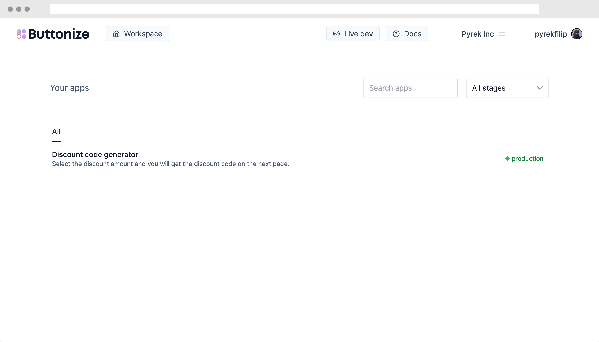
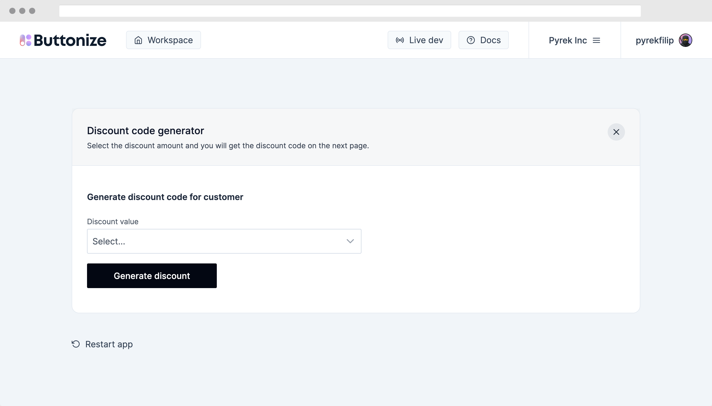

import { Tabs, TabItem } from '@astrojs/starlight/components'
import ScreenImage from '@components/ScreenImage.astro'
import FrameworkSelect from '@components/FrameworkSelect.astro'

<FrameworkSelect />

Make sure to first sign up at [app.buttonize.io](https://app.buttonize.io) and create or join an organization.

## Install Buttonize

[`buttonize`](https://github.com/buttonize/buttonize) package contains Buttonize CDK Constructs and CLI.

<Tabs>
  <TabItem label="npm">

```bash
npm install -D buttonize
```

  </TabItem>
  <TabItem label="pnpm">

```bash
pnpm add -D buttonize
```

  </TabItem>
  <TabItem label="yarn">

```bash
yarn add -D buttonize
```

  </TabItem>
</Tabs>

### (optional) Modify CDK `bin` code to export the App

If you would like to use Buttonize CLI for [local development](/core-concepts/local-development/)
you must export `cdk.App` so that the CLI is able to import the file and generate the CDK constructs tree
to show you the live-preview of the app.

```ts del={6} ins={7}
#!/usr/bin/env node
import 'source-map-support/register'
import * as cdk from 'aws-cdk-lib'
import { ExampleStack } from '../lib/example-stack'

const app = new cdk.App()
export const app = new cdk.App()

new ExampleStack(app, 'ExampleStack')
```

### API Key

Buttonize API Key is crucial for deploying Buttonize apps, you can create an API Key [here](https://app.buttonize.io/organization?scene=api-keys).

Once you have the API key, make sure to call `Buttonize.init` at the beginning of your CDK stack.

```ts collapse={1-4} ins={9-11}
import * as cdk from 'aws-cdk-lib'
import { Buttonize } from 'buttonize/cdk'
import { Construct } from 'constructs'

export class ExampleStack extends cdk.Stack {
	constructor(scope: Construct, id: string, props?: cdk.StackProps) {
		super(scope, id, props)

		Buttonize.init(this, {
			apiKey: 'PUT_API_KEY_HERE'
		})
	}
}
```

### Sample Buttonize app

**CDK Stack**

```ts title="lib/example-stack.ts" collapse={1-14}
import * as cdk from 'aws-cdk-lib'
import { NodejsFunction } from 'aws-cdk-lib/aws-lambda-nodejs'
import { Action, Buttonize, ButtonizeApp, Display, Input } from 'buttonize/cdk'
import { Construct } from 'constructs'
import * as path from 'path'

export class ExampleStack extends cdk.Stack {
	constructor(scope: Construct, id: string, props?: cdk.StackProps) {
		super(scope, id, props)

		Buttonize.init(this, {
			apiKey: 'PUT_API_KEY_HERE'
		})

		const discountGenerator = new NodejsFunction(this, 'DiscountGenerator', {
			entry: path.join(__dirname, '../', 'src', 'discountGenerator.ts')
		})

		new ButtonizeApp(this, 'DemoApp', {
			name: 'Discount code generator',
			description:
				'Select the discount amount and you will get the discount code on the next page.'
		})
			.page('InputPage', {
				body: [
					Display.heading('Generate discount code for customer'),
					Input.select({
						id: 'discount',
						label: 'Discount value',
						options: [
							{ label: '30%', value: 30 },
							{ label: '60%', value: 60 }
						]
					}),
					Input.button({
						label: 'Generate discount',
						onClick: Action.aws.lambda.invoke(
							discountGenerator,
							{ Payload: { discountValue: '{{discount}}' } },
							{ id: 'discountGenerator' }
						),
						onClickFinished: Action.buttonize.app.changePage('DonePage')
					})
				]
			})
			.page('DonePage', {
				body: [
					Display.heading('Discount generated'),
					Display.text('Discount code: {{InputPage.discountGenerator.code}}')
				]
			})
	}
}
```

**Lambda handler**

```ts title="src/discountGenerator.ts"
export const handler = async (event: { discountValue: number }) => {
	console.log(`Generating discount of value ${event.discountValue}`)

	return {
		discountValue: event.discountValue,
		code: `${Math.random()}`.split('.')[1]
	}
}
```

### Local development

Once you start local development with `buttonize dev` you can go to [`app.buttonize.io/live`](https://app.buttonize.io/live) to view your application.

Buttonize CLI monitors changes in your CDK code and always renders the latest version of the app. In case the app is deployed Buttonize CLI fetches all the
necessary information from AWS to make sure the app is fully working also locally.

:::caution
At the moment Buttonize **doesn't handle redeployment of your CDK code and lambda handlers**. So if you will make any changes to your lambda functions or other resources
they won't get deployed. For that we recommend using `cdk watch` in parallel with Buttonize CLI.
:::

:::note
At this stage, the app is not deployed to AWS yet. So invoking any [Actions](/core-concepts/actions/) won't work.

You can deploy your app with `$ cdk deploy` and then click on `Rebuild` button in Buttonize.

This will refetch all data necessary to invoke your AWS resources even during local development.
:::

<ScreenImage>
	
</ScreenImage>

### App deployment

Since Buttonize seamlessly integrates into your CDK application as a CDK Construct, you can deploy your Buttonize apps just by executing standard deployment commands.

```bash
cdk deploy
```

Once you deploy the app, you can go to [app.buttonize.io](https://app.buttonize.io) and you will see your app right there.

<ScreenImage>
	
</ScreenImage>

And the application itself looks like this.

<ScreenImage>
	
</ScreenImage>

### You have deployed your first Buttonize app

Congrats! Let us know how you liked it [on Discord](https://discord.gg/2quY4Vz5BM).
