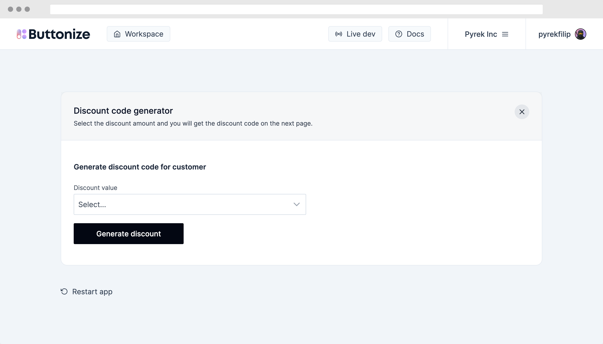

import { Tabs, TabItem } from '@astrojs/starlight/components'
import ScreenImage from '@components/ScreenImage.astro'

Make sure to first sign up at [app.buttonize.io](https://app.buttonize.io) and create or join an organization.

## Setup starter project

Clone starter project, install dependencies and start Buttonize local development.

<Tabs>
	<TabItem label="npm">

```bash {"Install dependencies":2} {"Run Buttonize local development":4}
npx create-buttonize && \

cd my-buttonize-app && npm install && \

npx buttonize dev bin/cdk.ts
```

  </TabItem>
	<TabItem label="pnpm">

```bash {"Install dependencies":2} {"Run Buttonize local development":4}
pnpm create buttonize && \

cd my-buttonize-app && pnpm install && \

pnpm buttonize dev bin/cdk.ts
```

  </TabItem>
	<TabItem label="yarn">

```bash {"Install dependencies":2} {"Run Buttonize local development":4}
yarn create buttonize && \

cd my-buttonize-app && yarn install && \

yarn buttonize dev bin/cdk.ts
```

  </TabItem>
</Tabs>

### API Key

If you go through the onboarding tutorial on [app.buttonize.io](https://app.buttonize.io) we will show you commands containing also
an API Key value.

Buttonize API Key is crucial for deploying Buttonize apps.
In case you don't see the API key or you don't want to go through the onboarding, you can create an API Key [here](https://app.buttonize.io/organization?scene=api-keys).

Once you have the API key, make sure to call `Buttonize.init` at the beginning of your CDK stack.

```ts
Buttonize.init(this, {
	apiKey: 'PUT_API_KEY_HERE'
})
```

### Local development

Once you start local development with `buttonize dev` you can go to [`app.buttonize.io/live`](https://app.buttonize.io/live) to view your application.

Buttonize CLI monitors changes in your CDK code and always renders the latest version of the app. In case the app is deployed Buttonize CLI fetches all the
necessary information from AWS to make sure the app is fully working also locally.

:::caution
At the moment Buttonize **doesn't handle redeployment of your CDK code and lambda handlers**. So if you will make any changes to your lambda functions or other resources
they won't get deployed. For that we recommend using `cdk watch` in parallel with Buttonize CLI.
:::

:::note
At this stage, the app is not deployed to AWS yet. So invoking any [Actions](/core-concepts/actions/) won't work.

You can deploy your app with `$ cdk deploy` and then click on `Rebuild` button in Buttonize.

This will refetch all data necessary to invoke your AWS resources even during local development.
:::

<ScreenImage>
	
</ScreenImage>

### App deployment

Since Buttonize seamlessly integrates into your CDK application as a CDK Construct, you can deploy your Buttonize apps just by executing standard deployment commands.

```bash
cdk deploy
```

Once you deploy the app, you can go to [app.buttonize.io](https://app.buttonize.io) and you will see your app right there.

<ScreenImage>
	
</ScreenImage>

And the application itself looks like this.

<ScreenImage>
	
</ScreenImage>

### You have deployed your first Buttonize app

Congrats!
