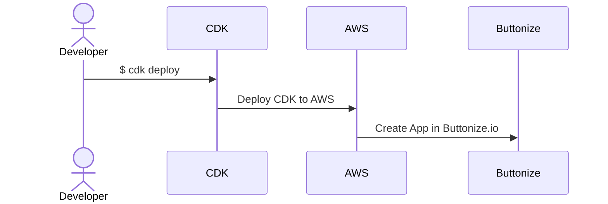

import { Card, CardGrid } from '@astrojs/starlight/components'

## What is Buttonize?

<CardGrid stagger>
	<Card title="Internal tooling platform" icon="rocket">
		Buttonize is SaaS platform for building admin user interfaces for
		cloud-native applications.
	</Card>
	<Card title="Built for engieneers" icon="laptop">
		No need to do click-ops with Buttonize. Everything is code here. We love
		infrastructure as code.
	</Card>
	<Card title="Plug-and-play" icon="approve-check-circle">
		[Just use our CDK constructs.](https://github.com/buttonize/buttonize-cdk)
		Simply add API key and deploy your first Buttonize app with `cdk deploy` in
		2 minutes.
	</Card>
	<Card title="Community" icon="discord">
		[Join our Discord community](https://discord.gg/2quY4Vz5BM) and share your
		ideas, needs and get help if you get stuck.
	</Card>
</CardGrid>

## How Buttonize works?

Buttonize allows you to create UI apps with AWS CDK directly hooked to your AWS infrastructure.

