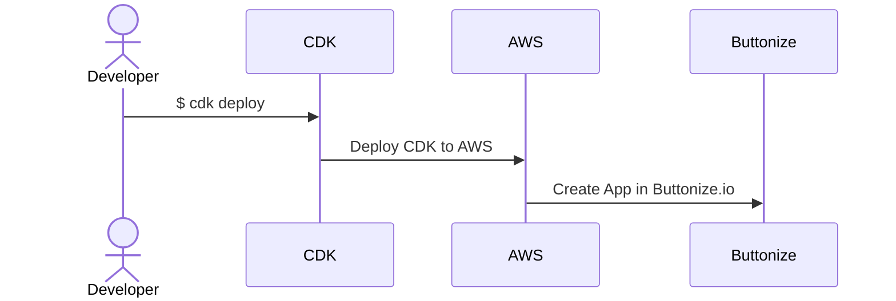

import { Card, CardGrid } from '@astrojs/starlight/components'

Buttonize is a fully managed SaaS platform connected directly to your cloud environment providing you with an Infrastructure as Code abstraction such as AWS CDK over rich set of frontend components and actions.

<CardGrid>
	<Card title="Quickstarts & Tutorials" icon="rocket">
		[Get started](/getting-started/installation/) in few minutes. Use what you
		already have and love.
	</Card>
	<Card title="Components" icon="laptop">
		[Visit component library](/core-concepts/components/). No need to do
		click-ops with Buttonize. Everything is code here.
	</Card>
	<Card title="Plug-and-play" icon="approve-check-circle">
		[Just use our CDK constructs.](https://github.com/buttonize/buttonize-cdk)
		Simply add your API key and deploy your first Buttonize app with `cdk
		deploy` in 2 minutes.
	</Card>
	<Card title="Community" icon="discord">
		[Join our Discord community](https://discord.gg/2quY4Vz5BM) and share your
		ideas, needs and get help if you get stuck.
	</Card>
</CardGrid>

 

## How Buttonize works?

Buttonize allows you to create UI apps with AWS CDK directly hooked up to your AWS infrastructure.

