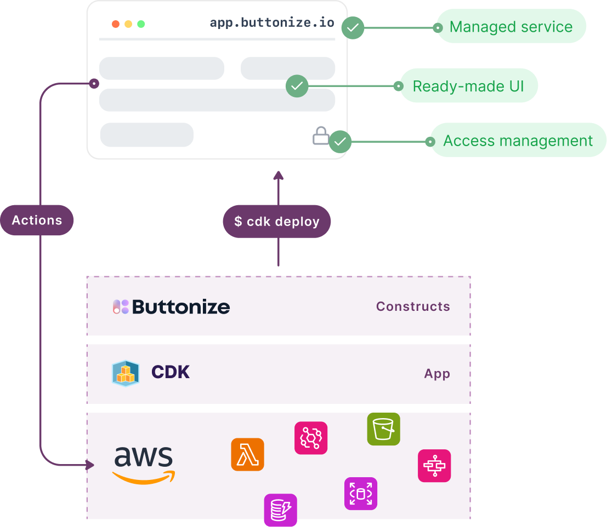

import { LinkCard, CardGrid } from '@astrojs/starlight/components'
import IntroCard from '@components/IntroCard.astro'
import ScreenImage from '@components/ScreenImage.astro'

Buttonize is a **fully managed** SaaS platform **connected directly to your AWS environment**
providing you with an Infrastructure as Code abstraction such as **AWS CDK** over rich
set of **UI components** and actions in order to build **internal tools** on top of the cloud.

 
 

<CardGrid>
	<IntroCard title="Getting started" icon="rocket">
		Build and deploy your first Buttonize app in minutes. All by using AWS CDK
		and Buttonize CDK Constructs.   [Get
		started](/getting-started/getting-started/).
	</IntroCard>
	<IntroCard title="Guides" icon="open-book">
		Take a look at some of our example guides on how to solve real-world business problems with Buttonize.   [Explore
		guides](/getting-started/guides/).
	</IntroCard>
	<IntroCard title="Local development" icon="laptop">
      Develop Buttonize apps with comfort of hot-reloading and instantly seeing the changes. The future is now. 
    	[Learn more](/core-concepts/local-development/).
    </IntroCard>
    <IntroCard title="Community" icon="discord">
      We want to hear from you. Join our community and report us any bugs and feature requests and ideas.  
    	[Join Discord community](https://discord.buttonize.io).
    </IntroCard>

</CardGrid>

 

## How Buttonize can help you

Buttonize helps developers and companies using AWS cloud to solve a painful problem of internal tooling.

<ScreenImage>
	

		
	

</ScreenImage>

### Problems with internal tooling

Internal tooling is indefinite problem. We all have in our companies all these "temporary" tools that
have been here forever and have many different funny names and everybody is afraid to touch their code.

When deciding about building internal tooling companies usually have three options

1. Build the app from scratch - API + auth + frontend + indefinite maintenance
2. Use drag-and-drop platform such as Retool - all developers hat no-code tools
3. Create Slack bots - text interface is sufficient only fir a small number of use-cases

### Buttonize comes to the rescue

We think these three principles are important when solving business problem via internal tools.

- Minimize future maintenance
- Build it quickly
- Don't reinvent the wheel

Buttonize gives you a way to build and deploy internal apps via tools you already use. We provide your with
[CDK Constructs](https://github.com/buttonize/buttonize) with simple interface that allow you to define UI components
and connect them to AWS. No need to worry about anything else. Just run `cdk deploy`. That's it.

## Let's try for yourself

<CardGrid>
	<LinkCard
		title="Build your first app"
		description="Let's build and deploy your first Buttonize App in 5 minutes."
		href="/getting-started/build-your-first-app/"
	/>
	<LinkCard
		title="Add Buttonize to existing project"
		description="Do you already have existing CDK project? Buttonize plugs in very easily."
		href="/getting-started/add-buttonize-to-existing-project/"
	/>
</CardGrid>

## Demo video

	<iframe
		width="560"
		height="315"
		src="https://www.youtube.com/embed/ureVu5yW3uo?si=1U6PM3bFYL5raiZN"
		title="YouTube video player"
		frameborder="0"
		allow="accelerometer; autoplay; clipboard-write; encrypted-media; gyroscope; picture-in-picture; web-share"
		allowfullscreen
	/>

